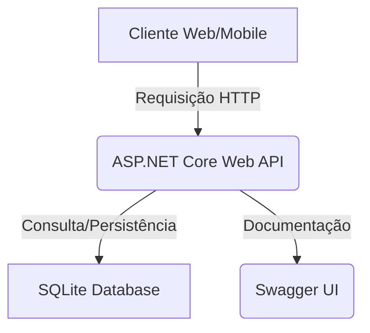

# ReVeste.API

  
  


> API RESTful para o projeto ReVeste, desenvolvida com ASP.NET Core e Entity Framework Core (SQLite).

## Visão Geral

Esta API gerencia informações de usuários e suas apostas, permitindo o registro, consulta, atualização e exclusão de dados. Faz parte da iniciativa ReVeste, que visa transformar hábitos de apostas em oportunidades de investimento.

## Tecnologias Utilizadas

- .NET 8
- ASP.NET Core Web API
- Entity Framework Core (SQLite)
- Swashbuckle (Swagger/OpenAPI)

## Pré-requisitos

- .NET SDK 8.0 ou superior
- Git
- Visual Studio Code (recomendado)

## Como Rodar o Projeto

1. **Clone o repositório:**
   ```bash
   git clone [URL_DO_SEU_REPOSITORIO] # Substitua pela URL do seu repositório Git
   cd ReVeste.API
   ```

2. **Restaure as dependências:**
   ```bash
   dotnet restore
   ```

3. **Crie e aplique as migrações do banco de dados:**
   ```bash
   dotnet ef migrations add InitialCreateSqlite
   dotnet ef database update
   ```
   A string de conexão para SQLite está configurada no `appsettings.json`.

4. **Execute a aplicação:**
   ```bash
   dotnet run
   ```

   A API estará disponível em `https://localhost:XXXX` (a porta será exibida no console).

## Documentação da API (Swagger UI)

Após iniciar a aplicação, acesse a documentação interativa da API no seu navegador:

[https://localhost:XXXX/swagger](https://localhost:XXXX/swagger) (Substitua XXXX pela porta exibida no console)

## Endpoints Principais

- `GET /api/Usuarios`: Lista todos os usuários.
- `GET /api/Usuarios/{id}`: Obtém um usuário por ID.
- `POST /api/Usuarios`: Cria um novo usuário.
- `PUT /api/Usuarios/{id}`: Atualiza um usuário existente.
- `DELETE /api/Usuarios/{id}`: Exclui um usuário.

- `GET /api/Apostas`: Lista todas as apostas.
- `GET /api/Apostas/{id}`: Obtém uma aposta por ID.
- `POST /api/Apostas`: Cria uma nova aposta.
- `PUT /api/Apostas/{id}`: Atualiza uma aposta existente.
- `DELETE /api/Apostas/{id}`: Exclui uma aposta.

### Endpoints de Pesquisa (LINQ)

- `GET /api/Apostas/ByUsuario/{usuarioId}`: Lista apostas por ID de usuário.
- `GET /api/Apostas/ValorMaiorQue/{valor}`: Lista apostas com valor maior que o especificado.
- `GET /api/Apostas/ByData/{data}`: Lista apostas por data específica.
- `GET /api/Usuarios/ByName/{nome}`: Lista usuários por nome.

## Arquitetura da API



## Autores

- André Sóler – RM98827
- Fabrizio Maia - RM551869
- João Pedro Marques – RM98307
- Victor Asfur - RM551684
- Vitor Shimizu – RM550390


